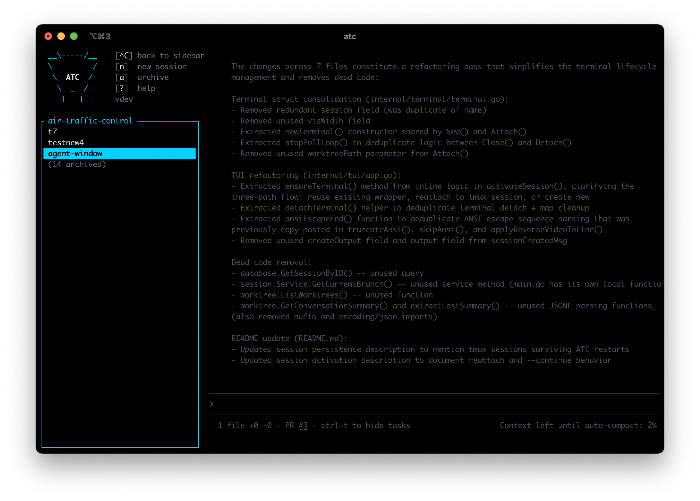

# ✈️ Air Traffic Control (ATC)

A CLI/TUI tool for managing multiple Claude Code agent sessions in separate git worktrees.



## Features

- **Session Management**: Create, list, archive, and delete Claude Code sessions
- **Git Worktrees**: Each session runs in its own isolated git worktree
- **Fuzzy Search**: Quickly find sessions by typing partial names
- **Setup Commands**: Automatically run setup commands from `.cursor/worktrees.json`
- **Session Persistence**: SQLite database tracks all sessions across restarts
- **Intuitive TUI**: Beautiful terminal interface built with Bubble Tea

## Installation

### Quick Install (macOS/Linux)

```bash
curl -fsSL https://raw.githubusercontent.com/kevinzwang/air-traffic-control/main/scripts/install.sh | bash
```

This installs the latest release to `~/.local/bin/atc`. Options:

```bash
# Install specific version
curl -fsSL https://raw.githubusercontent.com/kevinzwang/air-traffic-control/main/scripts/install.sh | bash -s -- --version v1.0.0

# Install to custom directory
curl -fsSL https://raw.githubusercontent.com/kevinzwang/air-traffic-control/main/scripts/install.sh | bash -s -- --install-dir /usr/local/bin
```

### Build from Source

Prerequisites: Go 1.21+, Git

```bash
git clone https://github.com/kevinzwang/air-traffic-control.git
cd air-traffic-control
go build -o atc ./cmd/atc
mv atc ~/.local/bin/  # or /usr/local/bin/
```

### Prerequisites

- Git
- Claude Code CLI (`claude`)

## Usage

### Start ATC

Navigate to any git repository and run:

```bash
cd /path/to/your/repo
atc
```

### TUI Controls

- **Type**: Search or enter new session name
- **↑/↓ or k/j**: Navigate between sessions
- **Enter**:
  - On "Create new session": Creates a new session
  - On existing session: Opens session in Claude Code
- **Ctrl+D**: Delete selected session (with confirmation)
- **Ctrl+A**: Archive/unarchive selected session
- **Esc**: Quit ATC

### Creating a Session

1. Run `atc` in your repository
2. Type a session name (e.g., "auth-refactor")
3. Press Enter on the "✨ Create new session" option
4. ATC will:
   - Create a git worktree at `~/.atc/worktrees/<repo-name>/<session-name>`
   - Create a new branch with the normalized session name
   - Run setup commands from `.cursor/worktrees.json` (if present)
   - Save the session to the database

### Opening a Session

1. Run `atc` in your repository
2. Type to filter sessions or navigate with ↑/↓
3. Press Enter on the desired session
4. ATC will exit and run `claude --continue` in the worktree directory

### Archiving a Session

1. Navigate to a session
2. Press Ctrl+A
3. The session is marked as archived and moved to the "Archived" section
4. Press Ctrl+A again to unarchive

### Deleting a Session

1. Navigate to a session
2. Press Ctrl+D
3. Confirm deletion by pressing Y
4. ATC will:
   - Remove the git worktree
   - Delete the session from the database

## Configuration

### Setup Commands

ATC is compatible with the `.cursor/worktrees.json` format. Create this file in your repository root:

```json
{
  "setup-worktree": [
    "npm install",
    "npm run build",
    "cp .env.example .env"
  ]
}
```

These commands will run automatically when creating a new session.

### Database

ATC stores session metadata in `~/.atc/sessions.db` (SQLite).

### Worktrees

All worktrees are stored at `~/.atc/worktrees/<repo-name>/<session-name>`.

## Architecture

```
air-traffic-control/
├── cmd/atc/           # Main entry point
├── internal/
│   ├── config/        # Config file parsing
│   ├── database/      # SQLite operations
│   ├── worktree/      # Git worktree management
│   ├── session/       # Business logic
│   └── tui/           # Terminal UI
```

## How It Works

1. **Session Creation**:
   - Creates a git worktree in `~/.atc/worktrees/`
   - Creates a new branch based on the session name
   - Runs setup commands from `.cursor/worktrees.json`
   - Saves session metadata to SQLite

2. **Session Entry**:
   - Updates last accessed timestamp
   - Exits TUI and changes to worktree directory
   - Executes `claude --continue` to resume conversation

3. **Session Deletion**:
   - Removes git worktree with `git worktree remove`
   - Deletes session record from database

## Troubleshooting

### "not a git repository"

Make sure you run `atc` from inside a git repository:

```bash
cd /path/to/your/git/repo
atc
```

### "Claude CLI not installed"

Install the Claude Code CLI first:

```bash
# Follow instructions at https://github.com/anthropics/claude-code
```

### Orphaned Worktrees

If you manually delete a worktree directory, you can clean up git's records:

```bash
git worktree prune
```

### Database Issues

If you encounter database corruption, you can reset it:

```bash
rm ~/.atc/sessions.db
```

Note: This will delete all session records (but not the worktrees themselves).

## Development

### Run Tests

```bash
go test ./...
```

### Build

```bash
go build -o atc ./cmd/atc
```

### Dependencies

- [Bubble Tea](https://github.com/charmbracelet/bubbletea) - TUI framework
- [Bubbles](https://github.com/charmbracelet/bubbles) - TUI components
- [Lip Gloss](https://github.com/charmbracelet/lipgloss) - Styling
- [go-sqlite3](https://github.com/mattn/go-sqlite3) - SQLite driver
- [uuid](https://github.com/google/uuid) - UUID generation

## License

MIT

## Contributing

Contributions are welcome! Please open an issue or submit a pull request.

## Credits

Built with [Bubble Tea](https://github.com/charmbracelet/bubbletea) by Charm.
